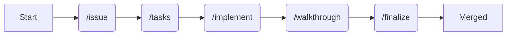

# AI-Driven Engineering Workflow

[](assets/promo.mp4)

**Standardize and automate your engineering process with Gemini CLI.**

This repository houses the **Workflow Extension** for Gemini CLI—a powerful set of autonomous tools designed to guide you through the entire software development lifecycle, from ambiguous idea to merged Pull Request.

It integrates seamlessly with **Linear** (for project management) and **GitHub** (for version control) to keep your focus on shipping value, not managing tickets.

---

# 100%
**Of my code is written by AI.**

I run AI-driven engineering workshops with companies worldwide—both remote and on-site. Some invite their whole engineering department, others bring non-technical teams along for the ride.

> "Last year summer, I asked myself a question: could I be an engineer without writing a single line of code? Not vibe coding—proper AI Driven Engineering.
>
> Today, my engineering life has been changed completely. I use AI agents for almost everything, and I write **0%** of the code myself.
>
> We are moving from a world of asking, **'What code do I write?'** to a world of asking, **'What problem do I need to solve?'**
>
> You are no longer limited by the syntax you know, the documentation you read, or the libraries you've memorized. You'll be limited only by your imagination and your token budget."

---

## 📦 Installation

**For Gemini CLI:**
```bash
gemini extensions install https://github.com/SaschaHeyer/ai-driven-engineering --auto-update
```

**For Claude Code:**
Open Claude Code in your terminal and run:
```bash
/plugin install ai-driven-engineering@SaschaHeyer/ai-driven-engineering
```

### Local Development
If you have cloned this repository locally and want to test changes:

**For Gemini CLI:**
```bash
gemini extensions link ./workflow-extension
```

**For Claude Code:**
You can start Claude Code and point it to your local directory:
```bash
claude --plugin-dir /path/to/ai-driven-engineering
```
Or, add it directly via the CLI:
```bash
claude plugin add /path/to/ai-driven-engineering
```

---

## 🎯 Motivation

**"The entire purpose of this structured workflow is to do the hard clarification and planning work upfront."**

This isn't for quick, one-line fixes. This workflow is designed for shipping **significant new features** or handling **complex migrations** in large, existing codebases—work that involves multiple files, new logic, and proper engineering effort.

**Why?**
By investing time in the first two steps (Define & Plan), we enable our AI agents to run **autonomously for hours** with minimal supervision.

We break the workflow into distinct phases: **Issue**, **Task**, **Implement**, and **Walkthrough**. This structure provides the context and boundaries the agent needs to execute complex work without constantly asking, "What next?"

---

## 🌳 The Secret Weapon: Git Worktrees

**"You can't have agents working in the same folder; they would just overwrite each other's work."**

To enable true parallel autonomy, we leverage **Git Worktrees**. This feature allows you to check out multiple branches from a single repository into separate directories.

Imagine one repository, but with 10, 15, or 20 different features and bugs, each living in its own clean, isolated folder.

- **Agent A** works on `feature-1` in `worktrees/feature-1`.
- **Agent B** fixes `bug-2` in `worktrees/bug-2`.

They run in parallel, on the same codebase, completely isolated. **No conflicts. No stash hell.** You can test each agent's work in its own dedicated folder.

This workflow is optimized around standard `git worktree` commands, which are handled automatically for you by the included `git-worktree` skill.

The `/implement` command [linked here](commands/engineering/implement.toml) is designed to handle this isolation automatically.

---

## 🚀 The Workflow

We follow a strict **Define → Plan → Build → Walkthrough → Ship** cycle. This extension provides a specialized AI agent command for each stage.



| Stage | Command | Description |
| :--- | :--- | :--- |
| **1. Define** | `/issue` | Turns a rough idea into a comprehensive **Product Requirements Document (PRD)** or Bug Brief directly in Linear. |
| **2. Plan** | `/tasks` | Analyzes the PRD and generates a detailed **Implementation Plan** with parent tasks and atomic sub-tasks. |
| **3. Build** | `/implement` | **The Builder Agent.** Autonomously writes code, runs tests, and commits changes for every task in the plan (using Git Worktrees). |
| **4. Walkthrough** | `/walkthrough` | **(Experimental)** The Proof Agent. Generates a narrative summary and visual storyboard (screenshots/GIFs) of the changes. |
| **5. Ship** | `/finalize` | Polishes the worktree, resolves conflicts, and opens/updates the **GitHub Pull Request**. |

---

## 📖 Command Reference

### 1. `/issue` (Define)
**"The agent is the PM for five minutes."**

It all starts here. The biggest risk isn't writing the wrong code—it's building the wrong thing. We don't start with code; we start with clarity.

1.  **Pull Context**: The agent grabs the Linear issue through the MCP, ingesting any title, notes, or prior context.
2.  **Clarifying Loop**: It drives a targeted question-and-answer session to help you think through the entire feature (Goal, User Stories, Edge Cases).
3.  **Draft PRD**: With those answers, the agent writes a clean **Product Requirements Document (PRD)** (Intro, Goals, User Stories, Functional Requirements, Metrics) and inserts it as a `## PRD` section in the Linear ticket.

*We are not coding yet. This is just refining what we actually need.*

### 2. `/tasks` (Plan)
**"Bridge the gap from product to engineering."**

Now that we know *what* we're building, we figure out *how*. The agent takes the PRD and converts it into a comprehensive **Implementation Plan**.

1.  **Analyze & Draft**: It reads the PRD and creates high-level parent tasks.
2.  **Detail Sub-tasks**: It drills down into each parent task, breaking them into atomic, step-by-step checklists.
3.  **Map Relevant Files**: It mines the repository to identify exactly which files need to be created or modified, listing them in a `### Relevant Files` section.
4.  **Sync & Validate**: The entire plan is written into a `## PLAN` section in Linear.

*This is our roadmap. We (the engineers) review and validate this plan before a single line of code is written.*

### 3. `/implement` (Build)
**"Where the magic happens."**

This step runs as a fully autonomous loop. The agent becomes your pair programmer.

1.  **Pull Approved Plan**: It reads the engineer-approved `## PLAN` from Linear as the single source of truth.
2.  **Execute**: It grabs the first unchecked sub-task, writes the code, and runs the tests.
3.  **Sync**: After each step, it checks off the sub-task in Linear `[x]` and adds a progress comment.
4.  **Worktrees & Learnings**: It automatically utilizes the `git-worktree` skill to isolate work in a new branch, and the `document-learnings` skill to record solutions and fixes to `docs/learnings/`.
5.  **Repeat**: It immediately grabs the next sub-task and continues.

*It runs continuously until the plan is complete or it gets blocked, at which point it pauses to notify you.*

### 4. `/walkthrough` (Experimental)
**"Seeing is believing."**

After implementation is complete, the agent provides a human-readable summary and visual proof of what was built. This is essential for stakeholders and reviewers.

1.  **Narrative Summary**: It writes a concise overview of the problem, the solution, and the key logic/UI changes.
2.  **Visual Storyboard**: Using the **Chrome DevTools MCP**, the agent automates your browser to navigate the app and capture screenshots of the new functionality.
3.  **Sync**: The storyboard and summary are attached directly to the Linear issue under a `## Walkthrough` section.

*This turns raw commits into a clear, professional update for the rest of the team.*

### 5. `/finalize` (Ship)
**"The finishing touch."**

Once implementation is complete, we prepare for delivery. This command ensures your work is clean, consistent, and ready for review.

1.  **Clean Up**: Checks for any unstaged changes or leftover artifacts in the worktree.
2.  **Update**: Fetches the latest `development` branch and rebases or merges to ensure your feature is up-to-date.
3.  **Resolve**: Attempts to auto-resolve merge conflicts (asking for guidance if they are complex).
4.  **PR**: Opens or updates a GitHub Pull Request with a concise summary and link to the Linear issue.

---

## 🧰 Included Skills & MCPs

This extension includes specialized agent skills and integrations to assist in the workflow. These are automatically invoked by the commands when needed:

### 1. `git-worktree`
Manages Git worktrees to allow isolated, parallel development. Instead of switching branches in your main directory, this skill:
- Creates a new isolated worktree and branch for the feature or bug (e.g., `worktrees/feature/<ticket-id>`).
- Evaluates the codebase for local files (like `.env` or configurations) and **copies** them from the original repository into the worktree.
- Ensures you can have multiple agents working on different tickets simultaneously without overlapping while maintaining a functional local environment.

### 2. `document-learnings`
A frictionless way to capture solved problems and project-specific knowledge.
- Automatically invoked when a solution is found or a problem is fixed during implementation.
- Creates concise, searchable markdown files in `docs/learnings/` (e.g., `YYYY-MM-DD-short-topic.md`).
- Helps agents surface past solutions to prevent repeating the same mistakes in future tasks.

### 3. Chrome DevTools MCP
Integrated browser automation that allows the agent to verify UI changes visually.
- Used by `/walkthrough` to navigate local development servers.
- Capable of taking screenshots and performing user actions (click, type, hover) to demonstrate new features.

---

## 🛠 Prerequisites

To use this workflow effectively, ensure you have the following configured in your Gemini CLI or environment:

1.  **Gemini CLI** (Latest version)
2.  **Linear MCP** (Configured with your API key)
3.  **Chrome DevTools MCP** (Installed via the extension)
4.  **GitHub CLI** (`gh` tool installed and authenticated)
5.  **Git** (Initialized repository)

---

## 🤝 Contributing

Contributions are welcome! Please follow the existing patterns defined in `commands/engineering/*.toml` and ensure any changes to the workflow logic are reflected in `GEMINI.md`.

**Updating Commands:**
This repository supports both Gemini CLI and Claude Code. The Gemini `.toml` files are the "Source of Truth". 
If you add or modify a command in `commands/engineering/`, or update `GEMINI.md`, you must run the sync script to generate the Claude Code equivalents before committing:

```bash
node scripts/sync-claude.mjs
```
*(Note: A GitHub Action is also configured to run this automatically on push to `main` as a safety net).*

1.  Fork the repo.
2.  Create a feature branch.
3.  Submit a PR (ironically, you can use the workflow to build the workflow).
